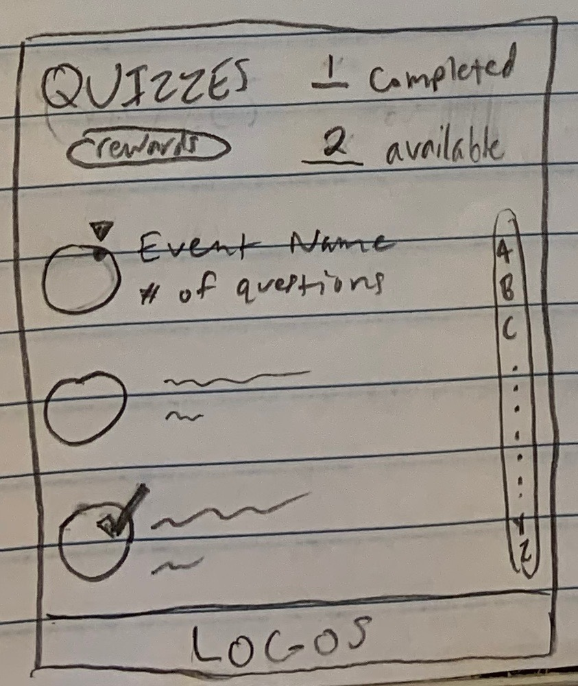
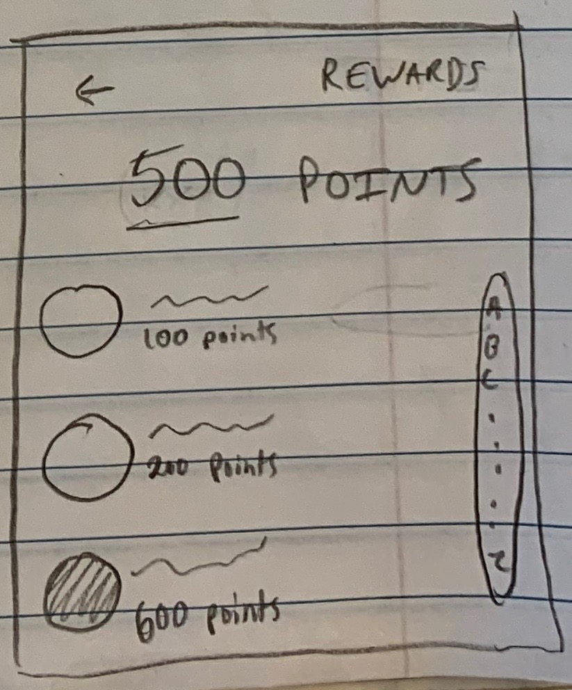

# Design Specification

Roles:
- Anant Rajeev - CEO
- Sanjay Unni - CDO
- Chris Forbes - PM 
- Amogh Dave - CTO
- Thomas Penner - CTO

Mission Statement: Seamlessly integrating diverse news sources into social media to combat media illiteracy

Problem Statement: Instagram is currently one of the world's most popular social media platforms. Social Media like Instagram has arrested the attention of growing children, so much so that teens in today's world don't "have the time" to stay up to date on current events or pressing news matters. Despite the prevalence of cell phones and access to the Internet in the modern era, teenagers nowadays generally don't have the propensity for - or an interest in - keeping up with news sources and getting informed on current events. A general lack of knowledge about these important topics can slowly create an uninformed population. Ultimately, this population has to make decisions about the future of their society; poor choices can create cascading effects that can seriously impact future generations down the line. It's important to bring news and current events to prospective voters today, but in such a way that it becomes an everyday part of life rather than an intensive chore that's forced upon them. In doing so, teenagers can have the information they need to become productive members of society and set the standard for future generations to follow.

Solution: Our team envisions utilizing an Instagram API to recreate the application's feed, with the difference being that after a certain amount of photos and videos scrolled past, there is a snippet of a news story with a very short summary that they can quickly look at. 

  

Users will log into the application using the same credentials they would on the instagram app (IMG 1). Our service would use the instagram API to get the user's feed and relay it to them in a user friendly manner as shown in IMG 2. However, this feed would be modified to include "news posts" which are in the same format as as an instagram post. Once the user clicks on an instagram image post, the app will take the user into a mode where they can see the amount of likes and comments. however, if the user clicks on one of the news posts, it will take him/her to the actual article so they can read further. 

  

As a method of analyzing success rate and seeing how well our application is fairing amongst our customers and how much they're learning, we intend to create a games/quizzes tab inside the application where users can go to take a quiz on what they've scrolled over. In the game/quizzes tab (IMG 4), users can see the number of quizzes that're available and the number of ones they have completed. They can also see each quiz (and how many questions), search through them by alphabetical order, and view the new or completed ones. They have an opportunity to win points that they can potentially use to redeem prizes (IMG 5), therefore establishing an incentive for them to come back and use the application again. Users can also see what prizes they can redeem if they earn more points, again encouraging them to look at more news posts and participate in more quizzes.
