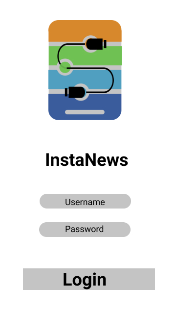
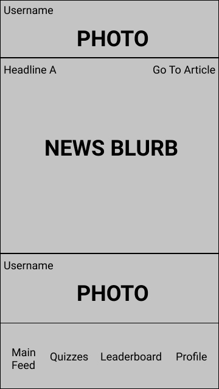
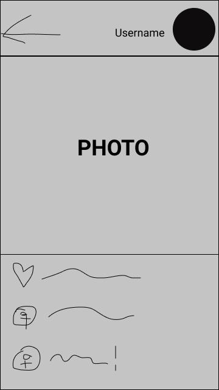
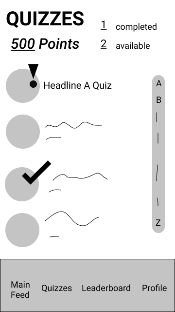
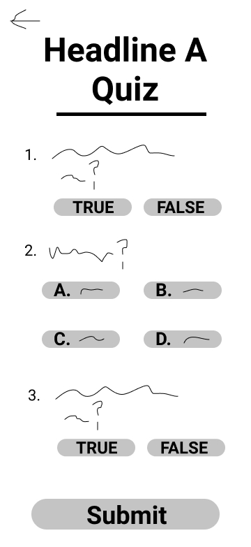
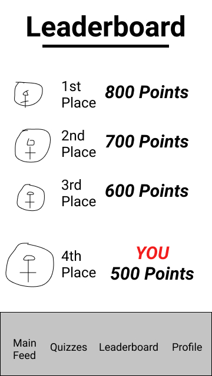
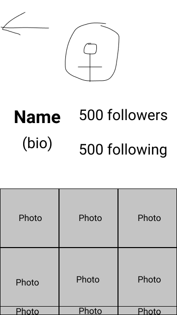

## Link to Production App: <a href="http://app-sendnews.herokuapp.com">app-sendnews.herokuapp.com<a>

# Design Specification

<h3>Roles:</h3>
- Anant Rajeev - CEO  
- Sanjay Unni - CDO  
- Chris Forbes - PM  
- Amogh Dave - CTO  
- Thomas Penner - CTO  

<h3>Mission Statement:</h3> Seamlessly integrating diverse news sources into social media to combat media illiteracy

<h3>Problem Statement:</h3> Instagram is currently one of the world's most popular social media platforms. Social Media (like Instagram) has arrested the attention of growing children, so much so that teens in today's world don't "have the time" to stay up to date on current events or pressing news matters. Despite the prevalence of cell phones and access to the Internet in the modern era, teenagers nowadays generally don't have the propensity for - or an interest in - keeping up with news sources and getting informed on current events. A general lack of knowledge about these important topics can slowly create an uninformed population. Ultimately, this population has to make decisions about the future of their society; poor choices can create cascading effects that can seriously impact future generations down the line. It's important to bring news and current events to prospective voters today, but in such a way that it becomes an everyday part of life rather than an intensive chore that's forced upon them. In doing so, teenagers can have the information they need to become productive members of society and set the standard for future generations to follow.

<h3>Solution:</h3> Our team envisions utilizing an Instagram API to recreate the application's feed, with the difference being that after a certain amount of photos and videos scrolled past, there is a snippet of a news story with a very short summary that they can quickly look at. 

  

<h3>Image Description: </h3>Users will log into the application using the same credentials they would on the Instagram app (IMG 1). Our service would use the Instagram API (as shown in the first image) to access the user's feed and relay it to them in a user friendly manner as shown in the second image. However, this feed would be modified to include "news posts" which are in the same format as as an Instagram post. The news post, as shown in the second image, will include a small blurb about the event/story and will include a "Go to Article" button in the top right corner that the user can click on to access an external website with the full article. The news events that are displayed are chosen using a backend web-scraping mechanism that picks up news stories from a variety of differing and reputed sources. The third image shows the event in which the user clicks or taps on an Instagram image post: the app will take the user into a display where they can see the amount of likes and comments, and the picture in its own tab. However, if the user clicks on one of the news posts, it will take them to the actual article so they can read further. 

  

<h3>Image Description:</h3> As a method of analyzing success rate and seeing how well our application is fairing amongst our customers and how much they're learning, we intend to create a games/quizzes tab inside the application where users can go to take a quiz on what they've scrolled over. These quizzes are based on the news articles, found on the main feed, that the user has clicked or tapped on. In the game/quizzes tab (IMG 4), users can see the number of quizzes that're available and the number of quizzes they have completed. They can also see each quiz, the article it corresponds to, search through them by alphabetical order, and view the new or completed ones. Each quiz has a set amount of points and a user can accumulate these points by completing more quizzes. The point count is shown at the top of the quiz tab screen. Tapping or clicking a quiz on the quiz tab screen opens up that quiz for the user. Quizzes are three questions long (IMG 5) with a mix of multiple choice questions and true or false questions. The questions will be made by parsing the news articles and finding keywords through the same backend web-scraping mechanism used to find news articles. The user can answer these questions and submit the quiz to earn points. When a user clicks submit or clicks the back button in the top left corner, the user will be brought back to the initial quizzes tab screen. However, if they click submit, the results will also be present on the quizzes tab screen. Clicking or tapping on the "Leaderboards" tab brings up the leaderboard screen (IMG 6). The leaderboard screen shows the Top 3 users numerically ranked by the amount of points. At the bottom of the screen, it shows the user's ranking in relation to the Top 3 users along with the user's accumulated points.

<h3>Image Description:</h3>
When the user clicks or taps on the "Profile" tab in the navigation bar, the user's profile will be displayed (IMG 7). It will display the user's profile picture at the top and center of the screen. Underneath the profile picture is the user's name, bio, number of followers and number of following. Underneath this information will be the user's posts laid out in a grid layout similar to the Instagram app. Clicking or tapping on a photo will open the picture in a new screen. By clicking or tapping a username or profile picture above a post, it opens up that corresponding user's profile but gives an option to return to the previous screen in the form of a back button at the top left corner of the screen.
